# Time Series Data Forcasting
Repository for Project#2. 

[Presentation](https://docs.google.com/presentation/d/1jt22KW9XMFdkfEoSn266YJJoJ0A-qkN3V7hcapGceZ4/edit#slide=id.g133b8366e19_0_49)

The stock market has always been an enigma. Analysts, investors and traders have always sought to predict the market. We set out to build a stock market predictor to properly track and predict the market using machine learning.

# Facebook Prophet model

I did a Facebook Prophet model for stock prices. The code takes one to three stocks and analyzes the data to predict 90 days into the future.

First, we get ticker data, validate the ticker symbol and create a dataframe for each symbol. In the example we used MSFT, GOOG, and TSLA.

Next, we create a list of tickers and loop through them. We then create a forecast dataframe that goes out 90 days.

We plot historical and future data.

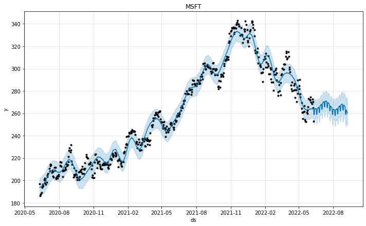

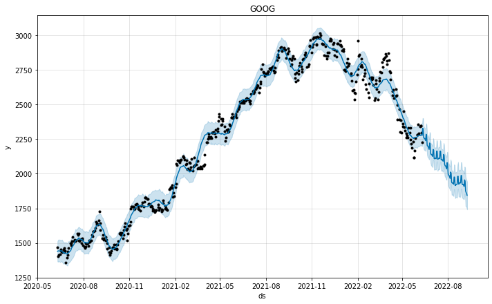

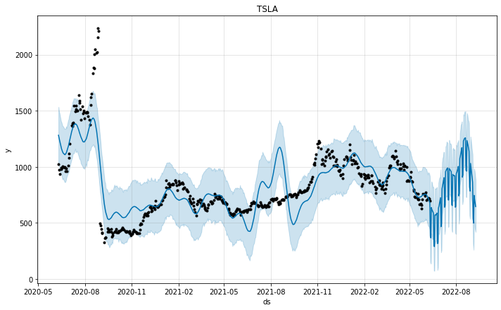

We determine Best Case, Worst Case and Most Likely Case for each symbol. In our example going out 90 days, MSFT has a Best Case of 271.81, a Worst Case of 249.01 and a Most Likely Case of 260.05. This most likely case represents a small gain. GOOG has a Best Case of 1943.35, a Worst Case of 1741.48, and a Most Likely Case of 1843.42. This most likely case implies a loss 90 days out. TSLA has a Best Case of 887.23, a Worst Case of 419.52, and a Most Likely Case of 646.46. This one implies a volatile scenario when best and worst cases are very far apart. The most likely case implies a small loss from todays price.

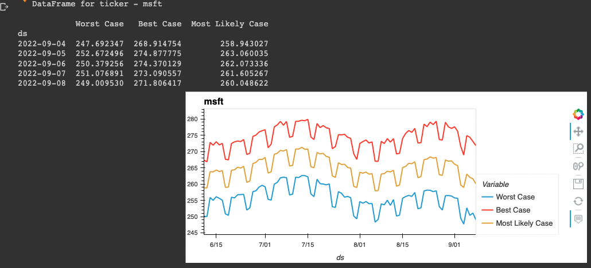

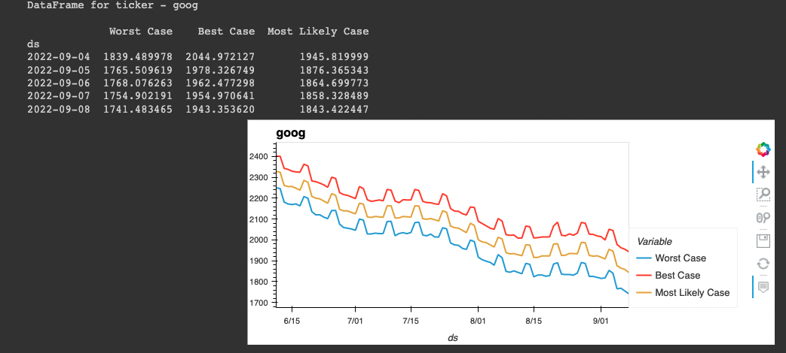

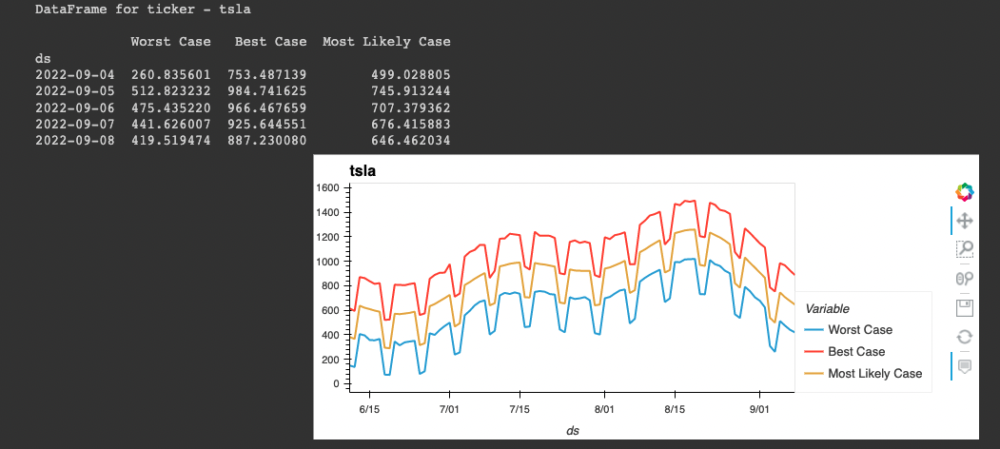

# LSTM - Long Short-Term Memory Networks

LSTM - Long Short-Term Memory network a variation of recurrent neural networks, is an efficient model for predicting long sequences of data. LSTM works with a feedback loop within it's architecture, which sets it aside from normal feedforward networks, which also makes it efficient in predicting long sequencential data.

Results of Predictions

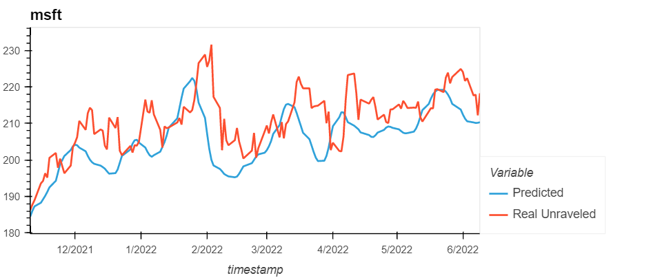
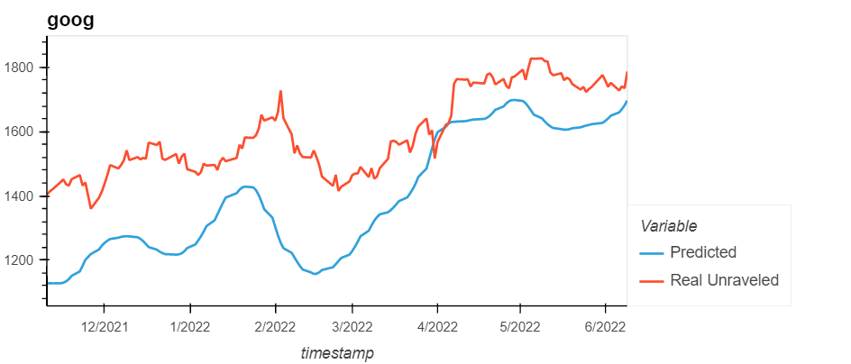 
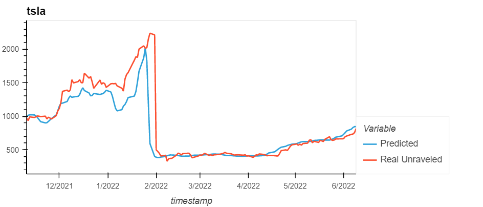

Results of Forecasting 

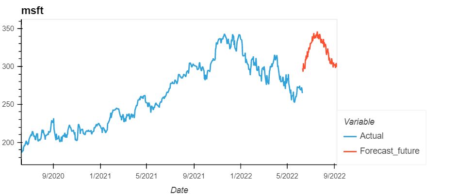
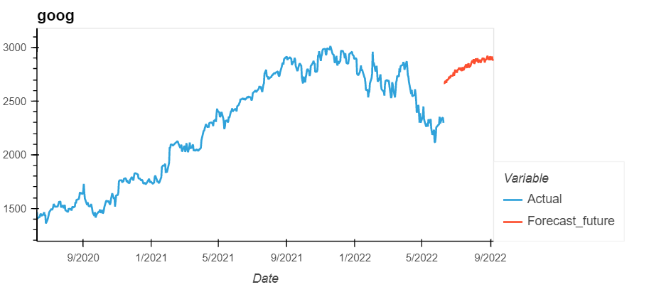 
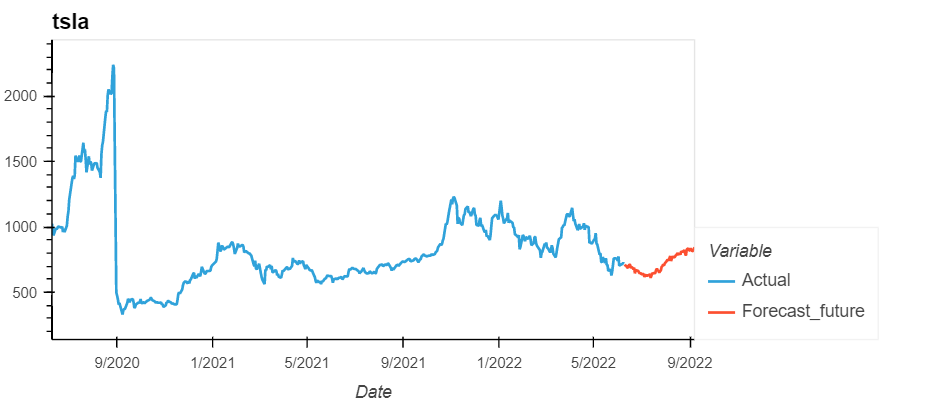

# Monte Carlo Cross - Validation (Shuffle Split) on LSTM
Data set was randomly partitioned into training and validation sets (70% training/20% validation/10% not used). We also split the data 20 times. 

# Final Takeaways and Improvements
- Using FB Prophet is an adequate solution for unsophisticated investors to forecast prices in the future. Due to its ease to setup and understand.
- Using larger data set would likely give better results. 
- Time Series with high level of autocorrelation are difficult to forecast reliably, because the best prediction for the nearest future is today's value.  Therefore, it might be a better strategy to use signals to trigger buy/sell events. 

	
