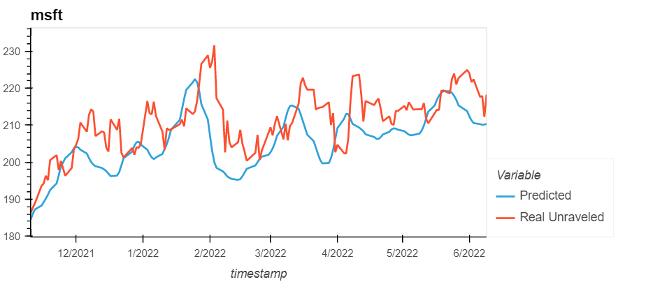
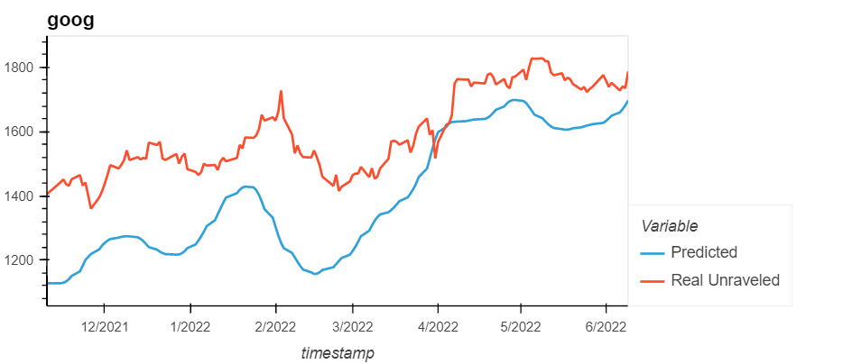
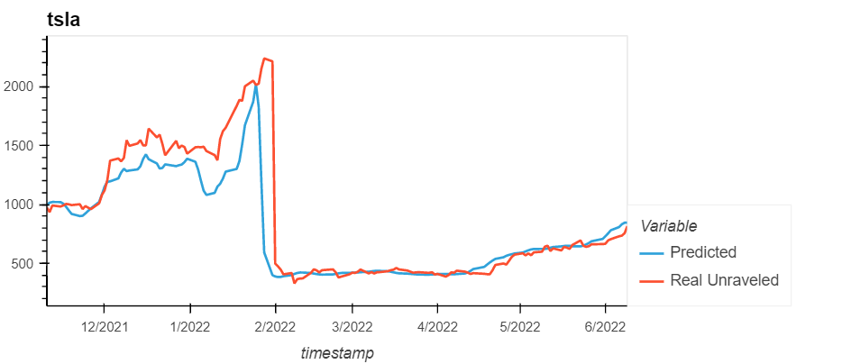
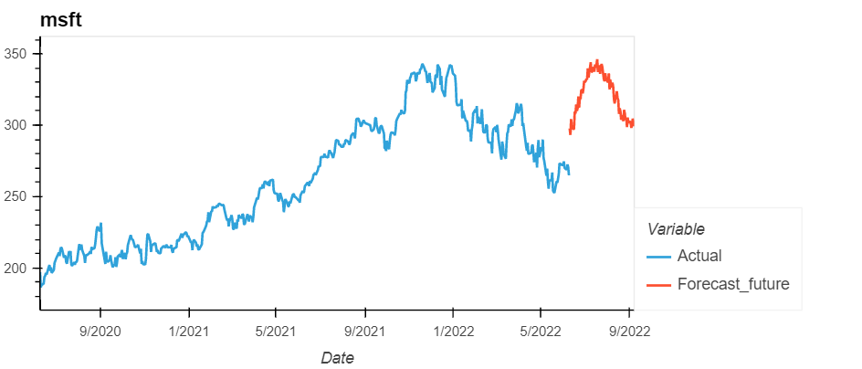

# LSTM for Stock price prediction and forecasting

LSTM - Long Short-Term Memory network a variation of recurrent neural networks, is an efficient model for predicting long sequences of data. LSTM works with a feedback loop within it's architecture, which sets it aside from normal feedforward networks, which also makes it efficient in predicting long sequencential data.

The [LSTM Notebook](LSTM.ipynb) allows the user to provide the ticker symbols to which the LSTM model is intended to be applied. The LSTM notebook utilizes the [master_functions.py](master_functions.py) module for the following activities - 

 - Validate ticker symbols entered by user.
 - Get Data from the AlphaVantage API and save it to csv files for the respective tickers.
 - Create DataFrames for each of the tickers 
 - Generate predictions for ticker data
 - Generate future forecasts for the tickers for a period of time in the future.

The results of the prediction and forecast are returned as dataframes which are then converted into csvs, stored under the [Data folder](Data)

## API used for Stock Data

 - AlphaVantage API; sample url - https://www.alphavantage.co/query?function=TIME_SERIES_DAILY&symbol={ticker_symbol}&outputsize=full&apikey={api_key}&datatype=csv
 - function used - TIME_SERIES_DAILY
 - Parameter outputsize - full
 - datatype - data retrieved as csv

## Parameters for predictions

 - split - 70%
 - number of units - 30
 - dropout fraction - 0.2
 - 3 Drop out layers and 1 dense output layer
 - optimizer user - adam and loss is measured using the mean squared error
 - Window size 20
 - epochs - 150
 - batch size - 35
 
### Loss for each ticker

## Parameters for Forecasting

 - lookback period 100
 - forecast period 90
 - number of units 30
 - epoch 150
 - batch size 35

## Results of predictions

 

## Results of forecasting

 

